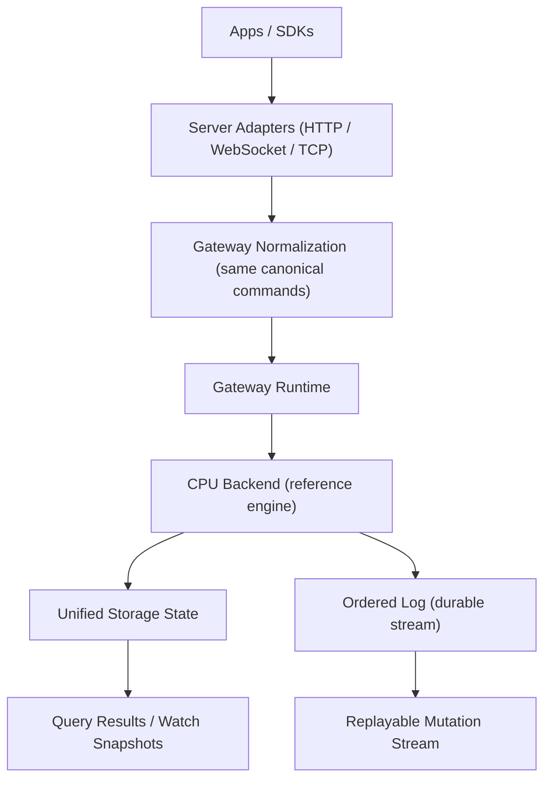
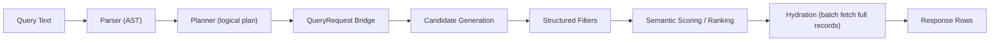
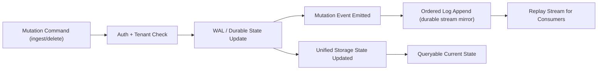
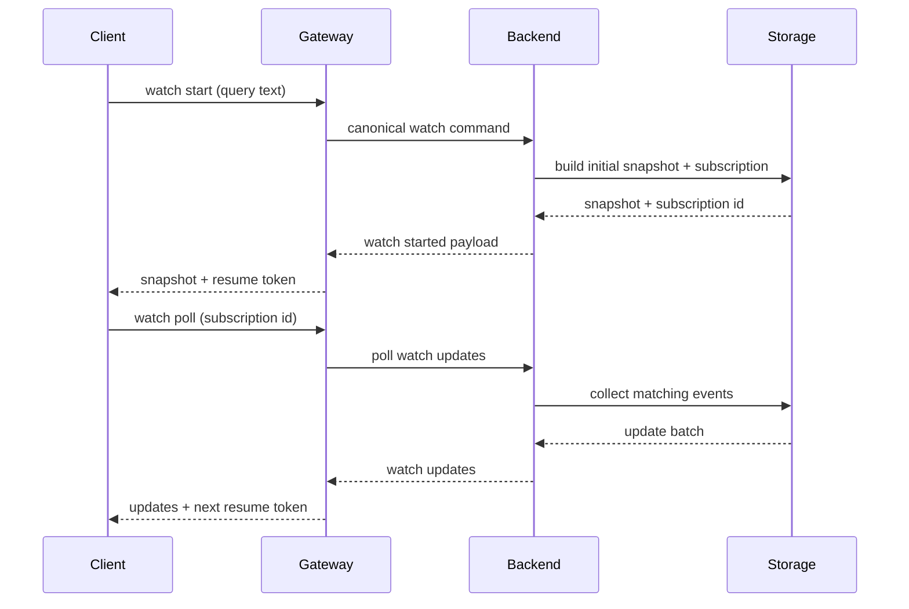
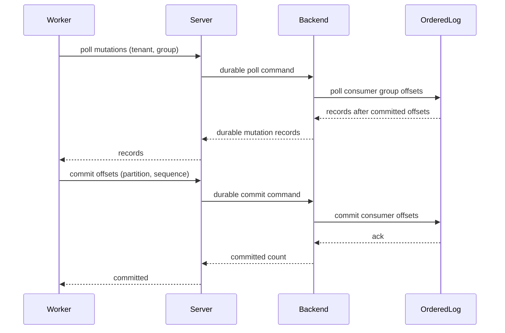
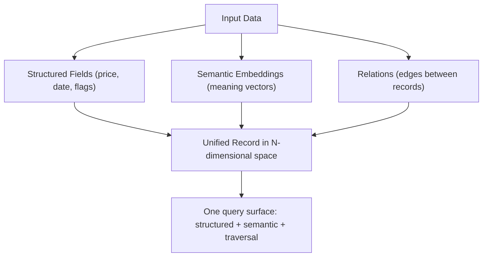
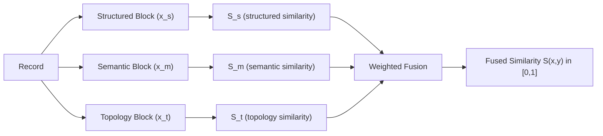
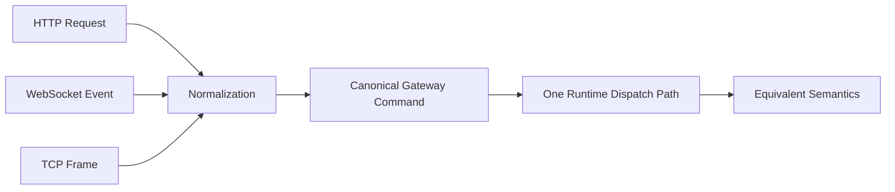

# iDB Visual Guide (Plain-English)

If DB internals feel confusing, use this page as your "map."
You can ignore implementation details and just track the flows.

Last synced with implementation: `2026-02-28`

## Sync Rule (keep diagrams current)

Update this file and [DB_DIAGRAMS_ASCII.md](./DB_DIAGRAMS_ASCII.md) whenever any of these change:
- request path (parser/planner/runtime/backend stages)
- write path (mutation events, WAL/state behavior)
- watch lifecycle semantics
- durable stream poll/commit behavior
- transport behavior (HTTP/WS/TCP normalization or parity)

## 1) Big Picture

What this means:
- clients can talk with different protocols
- server turns everything into one internal command shape
- backend runs queries/mutations
- storage holds current state, ordered log holds replayable mutation history

## 2) Query Flow (Read Path)

Mental model:
- find possible matches
- remove invalid ones
- rank best ones
- batch-fetch and return complete records

## 3) Write Flow (Ingest / Delete)

Mental model:
- every write updates current state
- every write also emits an event
- events are mirrored into ordered durable stream

## 4) Watch Flow (Live Updates)

Mental model:
- start watch once
- poll updates repeatedly
- updates are query-aware (not random global noise)
- poll bounds must be positive (`max_events > 0`)

## 5) Durable Mutation Stream (Replay + Commit Offsets)

Mental model:
- poll gets unprocessed events
- commit marks progress
- next poll resumes from committed position
- per-partition poll bounds must be positive (`max_events_per_partition > 0`)
- `consumer_group` must be non-empty

## 6) Why "One Storage" (Not DB vs Files)

Mental model:
- different "data shapes" still end up in one system
- query language can mix these modes in one flow

## 7) N-Space Kernel (Theory Track)

Kernel:
- `S(x,y) = (w_s*S_s + w_m*S_m + w_t*S_t) / (w_s + w_m + w_t)`
- `D(x,y) = 1 - S(x,y)`
- Deterministic per `nspace_version`

## 8) Transport Parity (Same Behavior Everywhere)

Mental model:
- protocol changes, behavior should not
